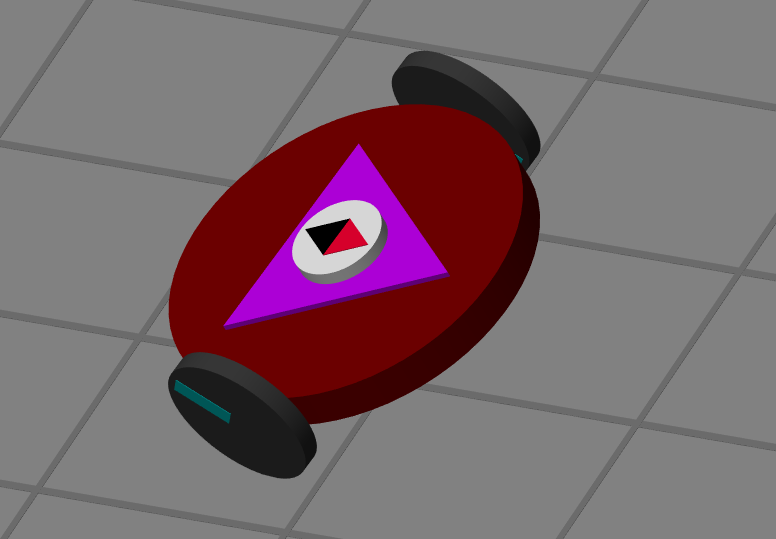
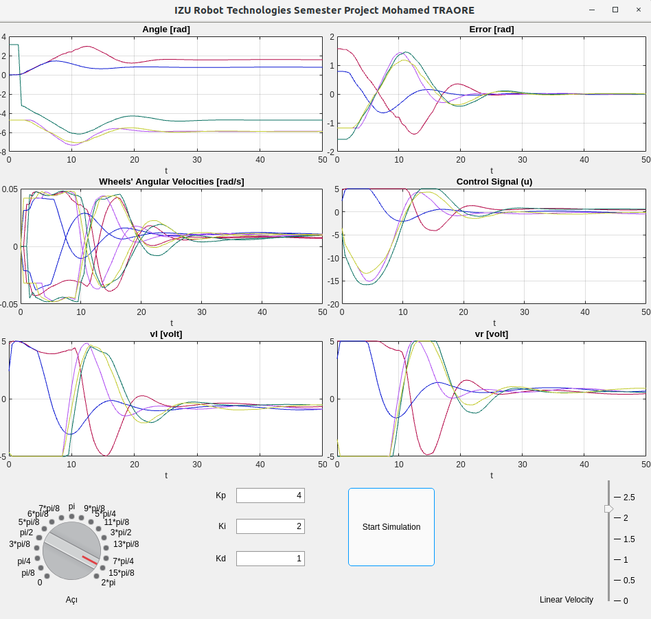
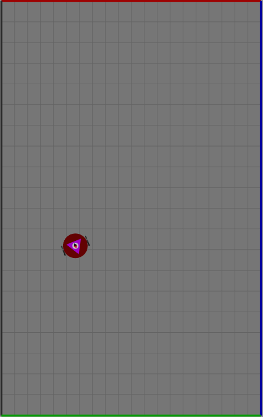
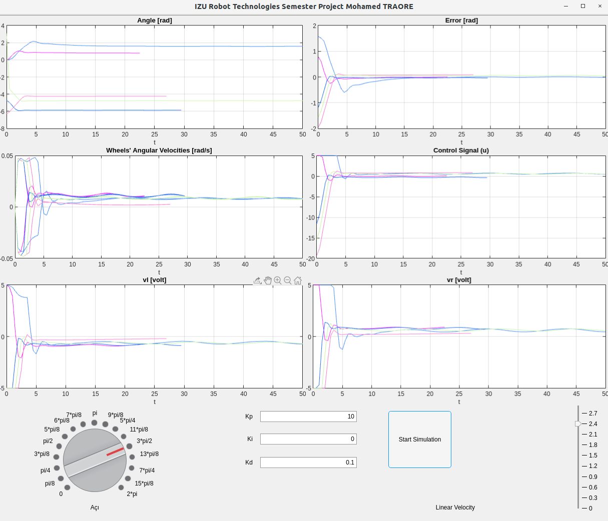

<h1> Angle Control of Differential Drive Robot </h1>
<h2> Introduction </h1>
<p> In this application, angle control of two-wheeled Differential Drive <br> type  Robot  is simulated in matlab environment by using PID controller. <br> Throughout the simulation  angle, error, angular velocities, control signal,<br> right  and left wheel tensions’ graphs  will be drawn on the application<br> interface and values will be printed on the matlab command line.<br> </p>
<h2> Technologies && required Plugins </h2>
<ul>
<li> Matlab   </li>
<li> Matlab app Designer  </li>
<li> Robotics Playground plugin </li>
</ul>
<h2> Robot && Backend Control </h2>
<h3> Robot </h3>

<h3> Backend Control[CODE]/h3>     
        
```matlab
        % Button pushed function: SimulasyonButton
        function SimulasyonButtonPushed(app, event)
            
            if (app.running==1)               
                app.SimulasyonButton.Text = 'Start Simulation';
                robot = app.myRobot;
                mlrobotstop(robot); % devam eden simulasyonu durdur
                app.running=0;
            else
                app.SimulasyonButton.Text = 'Stop';
                app.running=1;
                robot = app.myRobot;
                mlrobotstart(robot); % simulasyonu baslat

                %Değişkenlerin tanımlanması ve ilk değerlerin atanması
                
                T   =  50;                  %  Programın çalışma süresi 
                dt  =  0.5;                 %  delta t zamanı
                t   =  .0:dt:(T);           %  Zaman aralıkları 
                n   =  length(t);           %  t zaman vektörünün boyutu 
            
                P   =  0;                   %  Oransal   Kontrolcü sıfırlandı
                I   =  0;                   %  Integral  Kontrolcü sıfırlandı
                D   =  0;                   %  Türev     Kontrolcü sıfırlandı
                PID =  0;                   %  O-I-T     Kontrolcü sıfırlandı

                        
                Vmin  = -5;                 %  Maksimum gerilim değeri 5 olarak  atandı 
                Vmax  =  5;                 %  Minimum  gerilim değeri -5 olarak atandı
                Error =  0;                 %  Hata değeri sıfırlandı
                
                errorSum = 0;               %  hataların toplamı sıfırlandı
                errorPre = 0;               %  Bir önceki hata değeri sıfırlandı
                errorDif = 0;               %  Bir önceki ve şimdiki hataların farkı sıfırlandı
                
                angleArray  = zeros(1,n);   %  Robotun açısı dizisi oluşturuldu - boyutu n kadar 
                errorArray  = zeros(1,n);   %  Hata dizisi oluşturuldu 
                vlArray     = zeros(1,n);   %  Robotun sol tekerleği gerilim dizisi oluşturuldu     - boyutu n kadar 
                vrArray     = zeros(1,n);   %  Robotun sağ tekerleği gerilim dizisi oluşturuldu     - boyutu n kadar 
                angularVelr = zeros(1,n);   %  Robotun sağ tekerlek açısal hızı dizisi oluşturuldu  - boyutu n kadar 
                angularVell = zeros(1,n);   %  Robotun sol tekerlek açısal hızı dizisi oluşturuldu  - boyutu n kadar
                controlSig  = zeros(1,n);   %  Robotun kontrol sinyali dizisi oluşturuldu           - boyutu n kadar 
                                
                color = rand(1,3);          %  Renk kodu random olarak seçildi
                
                %PROGRAM AKIŞI
                
                for k = 1:n
                   userAngle    =  str2num(app.AciKnob.Value);               % Kullanıcı açısı sayı olarak alındı
                   currentAngle =  deg2rad(mlrobotreadcompassangle(robot));  % Robotun açısı rad olarak alındı  
                                     
                   if(userAngle==3*pi/2 )                                    % Kullanıcı açı girdisi 3*pi/2 ' ye eşit mi?
                      currentAngle  =  currentAngle + pi;                    % Öyle ise şuanki açıya  pi kadar ekle
                      Error         =  -userAngle + currentAngle;            % ve Hatayı hesapla
                   elseif(userAngle>3*pi/2 && userAngle<2*pi)                % kullanıcı açı girdisi 3*pi/2 ile 2*pi arasında mı ?
                       currentAngle =  currentAngle + 3*pi/2 ;               % Öyle ise şuanki açıya 3*pi/2 ekle
                       Error        =  -userAngle + currentAngle;            % ve Hatayı hesapla
                   elseif(userAngle>pi && userAngle<3*pi/2)                  % Kullanıcı açı girdisi pi ile 3*pi/2 arasında mı?
                      currentAngle = currentAngle + 2*(pi - currentAngle);   % Öyle ise açıya 2*(pi - currentAngle) değeri ekle
                      Error        = userAngle - currentAngle;               % Ve hatayı hesapla
                   else    
                       Error       = userAngle - currentAngle;               % Yukarıdaki koşullar sağlanmıyorsa hatayı hesapla
                   end

                   errorSum     =  Error + errorSum;                         % Baştan şu ana kadarki hataların toplamı alındı
                   errorDif     =  errorPre - Error;                         % Bir önceki ve şimdiki hataların farkı alındı                         
                   errorPre     =  Error;                                    % Bir önceki hata güncellendi 
                  
                   P   =  app.Kp.Value*Error;                                % Oransal  Kontrol Sinyali  hesaplandı
                   I   =  app.Ki.Value*errorSum*dt;                          % Integral Kontrol Sinyali  hesaplandı  
                   D   =  app.Kd.Value*errorDif/dt;                          % Türev    Kontrol Sinyali  hesaplandı
                  
                   PID =  P + I + D;                                         % O,I ve T kontrol sinyallerinin toplamıyla
                                                                             % PID Kontrol sinyalini elde ettik.

                   linearVel =  app.DogrusalHizSlider.Value;                 % Kullanıcı doğrusal hızı alındı                 
    
                   if(PID>Vmax) PID = Vmax; end                              % PID kontrol sinyali Vmax'ten büyük ise Vmax'i ata
                   
                   
                   if(currentAngle>=3*pi/2)                                  % Şuanki açı 3*pi/2 ' den büyük veya eşit mi?
                       currentAngle=-currentAngle;                           % Eşit ise açının tersini al
                   end
                   
                   if(currentAngle>pi && currentAngle<3*pi/2)                % Şuanki açı pi ile 3*pi/2 arasında mı?
                       currentAngle=-currentAngle;                           % öyle ise açının tersini al*
                   end
        
                   Vr = 0.5*linearVel*cos(-currentAngle)  +  PID;            % Sağ terleğe verilen gerilim
                   Vl = 0.5*linearVel*sin(-currentAngle)  +  PID;            % Sol terleğe verilen gerilim
                                                                             % "- currentAngle" Burada şuanki açının tersinin alınma
                                                                             % sebebi , robot istenen açıya varınca ileri devam etmesidir.
                                                                             % Aksi taktirde robot istenilen açıya varınca ters yöne gitmektedir.
                   
                   if(Vr>Vmax)  Vr =  Vmax; end                              % Vr gerilimi ,  Vmax'ten büyük ise Vmax'i ata
                   if(Vr<Vmin)  Vr =  Vmin; end                              % Vr gerilimi ,  Vmin'ten küçük ise Vmin'i ata
                   
                   if(Vl>Vmax)  Vl =  Vmax; end                              % Vl gerilimi ,  Vmax'ten büyük ise Vmax'i ata
                   if(Vl<Vmin)  Vl =  Vmin; end                              % Vl gerilimi ,  Vmin'ten küçük ise Vmin'i ata
                   
                    
                   angularVelocityRight = deg2rad(mlrobotreadwheelspeed(robot,'right'));    % Robotun sağ tekerleğin açısal hızı alındı [rad]
                   angularVelocityLeft  = deg2rad(mlrobotreadwheelspeed(robot, 'left'));    % Robotun sol tekerleğin açısal hızı alındı [rad]        
                                                                                       
                   errorArray(k)   =  Error;                        % k. hata, errorArray dizisine eklendi
                   vlArray(k)      =  Vl;                           % k. Vl, VlArray dizisine eklendi
                   vrArray(k)      =  Vr;                           % k. Vr, VrArray dizisine eklendi
                   angleArray(k)   =  currentAngle;                 % k. açı, angleArray dizisine eklendi
                   controlSig(k)   =  PID;                          % k. PID, kontrol sinyali controlSig dizisine eklendi
                   angularVelr(k)  =  angularVelocityRight;         % k. sağ tekerlek açısal hızı , angularVelr dizisine eklendi
                   angularVell(k)  =  angularVelocityLeft;          % k. sol tekerlek açısal hızı , angularVell dizisine eklendi
                   
                   
                   mlrobotsetmotorvoltage(app.myRobot,'right',Vr);  % Robotun sağ tekerleğine Vr gerilimi verildi
                   mlrobotsetmotorvoltage(app.myRobot,'left' ,Vl);  % Robotun sol tekerleğine Vl gerilimi verildi
                   
                   
                   fprintf('Angle = %7.3f [rad]\n',currentAngle);    % Matlab komut satırına güncel Açı değeri yazdırıldı
                   fprintf('Error = %7.3f [rad]\n',Error);           % Matlab komut satırına güncel Hata değeri yazdırıldı
                   fprintf('Vr    = %7.3f [volt]\n',Vr);             % Matlab komut satırına güncel Sağ tekerlek gerilim değeri yazdırıldı
                   fprintf('Vl    = %7.3f [volt]\n',Vl);             % Matlab komut satırına güncel Sol tekerlek gerilim değeri yazdırıldı
                   fprintf('PID   = %7.3f [Control Signal]\n',PID); % Matlab komut satırına güncel PID kontrol Sinyal değeri yazdırıldı
                   
                   
                   line(app.graph_aci,0:dt:t(k),angleArray(1:k),'Color',color)             % Robotun  açı grafiği çizdrildi
                   grid on; hold on;                  
                   
                   line(app.graph_hata, 0:dt:t(k),errorArray(1:k),'Color',color)           % Hata grafiği çizdrildi
                   grid on; hold on;
                   
                   line(app.graph_tekerlek_hiz, 0:dt:t(k),angularVelr(1:k),'Color',color)  % Robotun sağ tekerlek açısal hız grafiği çizdrildi
                   grid on; hold on;
                   
                   line(app.graph_tekerlek_hiz, 0:dt:t(k),angularVell(1:k),'Color',color)  % Robotun sol tekerlek açısal hız grafiği çizdrildi
                   grid on; hold on;
                   
                   line(app.graph_kontrol, 0:dt:t(k),controlSig(1:k),'Color',color)        % PID kontrol sinyali grafiği çizdrildi
                   grid on; hold on;        
                   
                   line(app.graph_vr, 0:dt:t(k),vrArray(1:k),'Color',color)                % Vr grafiği çizdrildi (Sağ tekerleğe verilen gerilim)
                   grid on; hold on;                 
                   
                   line(app.graph_vl, 0:dt:t(k),vlArray(1:k),'Color',color)                % Vl grafiği çizdrildi (Sol tekerleğe verilen gerilim)
                   grid on; hold on;
                  
                   pause(dt);     % Robotun hareket etmesi için dt saniye (0.5s) bekletildi   
                  
                end
                   %Simülasyonun çalışma süresi 50s dolduğunda simülasyon durdurulur. 
                   mlrobotstop(robot);                                % Robot durduruldu     
                   app.running = 0;                                   % Uygulama durduruldu
                   app.SimulasyonButton.Text = 'Start Simulation';  % App penceresi üzerindeki başlatma butonunun yazısı "Simulasyonu Başlat" ile değiştirildi.
                   
```
<h2> Launch </h2>
<h3> From user interface : </h3>
<p>
&nbsp;Adjust the desired angle <br>
&nbsp;Adjust the desired linear velocity<br>
&nbsp;Enter Kp, Ki, Kd  PID coefficients <br>
&nbsp;Start the simulation or stop if it is running <br>
&nbsp;&nbsp;otherwise the simulation will be running for 50 seconds.
</p>
<h3> Output examples </h3>
<h3> Graph1 </h3>

<h3> Robot Position (Last Angle)</h3>

<h3> Graph2 </h3>

<h2> Key Words </h2>
<ul>
 <li><strong>Angle: </strong>Current angle of the robot.</li>
 <li><strong>Error: </strong>Difference between the user entered angle and the current angle of the robot.</li>
 <li><strong>Angular Velocity:</strong>Angular velocities of  wheels of robot.</li>
 <li><strong>Control Signal:</strong>Signal of PID controller. </li>
 <li><strong>Right Wheel Tension:</strong>Tension given to the right wheel of the robot.</li>
 <li><strong>Left  Wheel Tension:</strong>Tension given to the Left  wheel of the robot.</li>
</ul>
<br>
<ul>
<li><strong>Kp : </strong>&nbsp; Coefficient of Proportional Controller.</li>
<li><strong>Ki : </strong>&nbsp; Coefficient of  Integral Controller.</li>
<li><strong>Kd : </strong>&nbsp; Coefficient of  Derivative Controller.</li>
<li><strong>PID: </strong>&nbsp; A proportional–integral–derivative controller also named as three-term controller.</li>
</ul>
